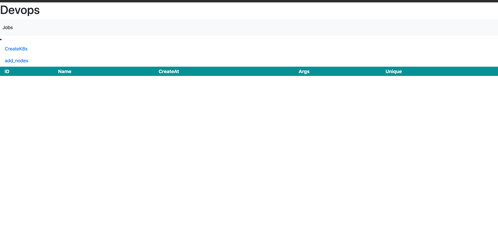

# function

- [x] install high available k8s masters
- [x] batch install slaves
- [] web terminal
- [x] dashboard(angular)

## swagger url
- http://xxx:xxx/swagger/index.html

## post example
### install master
```json
 {
  "name": "xxxx",
  "clusterName": "xxxxxxx",
  "controlPlaneEndpoint": "9.16.0.27",
  "registry":"registry.aliyuncs.com/google_containers",
  "primaryMaster":
  {
    "ip": "9.16.0.27",
    "password": "password",
    "port": 22,
    "user": "root"
  },
  "netWorkPlug": "cilium",
  "podCidr": "30.244.0.0/16",
  "serviceCidr": "30.96.0.0/16",
  "version": "1.21.5"
}
```

### install slaves
```json

{
  "version": "1.21.5",
   "master":{
      "ip":"9.16.0.27",
      "password":"password",
      "port":22,
      "user":"root"
   },
   "nodes":[
      {
         "ip":"47.242.36.172",
         "password":"password",
         "port":22,
         "user":"root"
      },
      {
         "ip":"47.242.65.108",
         "password":"password",
         "port":22,
         "user":"root"
      }
   ]
}
```

## feature:
- [x] support centos version
    - [x]  CentOS Linux 7 (Core)   3.10.0-957.el7.x86_64
    - [x]  Anolis OS 8.2           4.18.0-193.60.2.an8_2.x86_64
    
- [x] support k8s version
    - [x] 1.17.xxx
    - [x] 1.18.xxx
    - [x] 1.19.xxx
  
- [x] upgrade k8s
    - [x] 1.17 ---> 1.18.x
    - [x] 1.18 ---> 1.19.x
    - [x] 1.19 ---> 1.20.x
    - [x] 1.20.x --> 1.21.0 升级 (特殊)
    - [x] 1.21.x --> 1.22.x 升级 
  
## local start
- go run main.go
- cd front && ng serve --open

